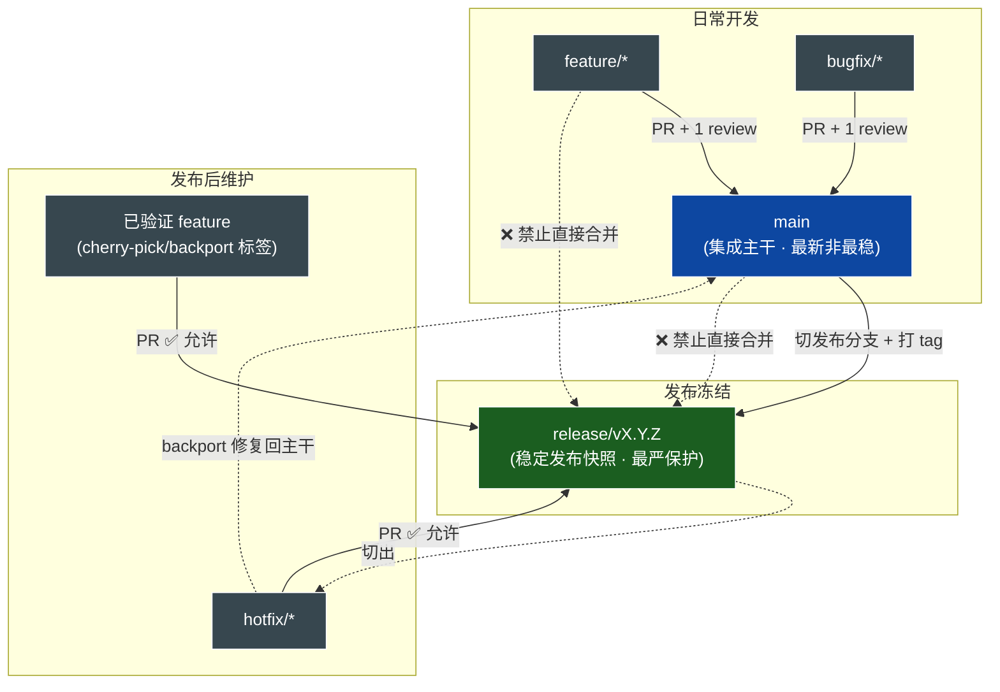

# TL;DR — GitHub 分支模型与发布管理策略

> 适用于全部交付仓库（7 仓）。**核心思想：`main` 是「最新但不保证最稳」的集成主干，`release/v*` 是「冻结的稳定发布分支」，二者治理规则不同。**
> 首次落地：`release/v1.1.5`（2026-06-28，7 仓全部应用保护 + 来源校验）。

---

## 1. 一句话总结

| 分支 | 角色 | 谁能进 | 稳定性 |
|---|---|---|---|
| `main` | 集成主干，收各类已验证 PR | 任意已 review 的 PR | 最新，**不保证最稳** |
| `release/v*` | 冻结的发布快照（如 `release/v1.1.5`） | **仅** `hotfix/*` + 已验证的 cherry-pick/backport | **最稳定**，受最严保护 |
| `hotfix/*` | 针对发布分支的紧急修复 | 从 `release/v*` 切出，修完 PR 回 `release/v*`（再 backport 回 `main`） | — |
| `feature/*` | 常规功能开发 | PR → `main`（**禁止**直接进 `release/*`） | — |

> 不设 `release/latest`——「最新发布版」由 tag/版本号语义表达，别名分支多余。

---

## 2. 受保护分支规则（`release/v*`）

7 仓的 `release/v1.1.5` 已应用以下 GitHub Branch Protection（通过 REST API `PUT /repos/{owner}/{repo}/branches/{branch}/protection`）：

| 规则 | 设置 | 含义 |
|---|---|---|
| 禁止直接 Push | ✅（PR 强制） | 所有变更走 PR |
| 禁止 Force Push | `allow_force_pushes: false` | 历史不可改写 |
| 禁止删除分支 | `allow_deletions: false` | 发布快照不可删 |
| Admin 不豁免 | `enforce_admins: true` | 管理员也受同等约束 |
| 强制 PR Review | `required_approving_review_count: 1` | 至少 1 人批准 |
| 过期 Review 失效 | `dismiss_stale_reviews: true` | 新 push 后需重新批准 |
| 必过 Status Checks | `required_status_checks.strict: true` | 含来源校验 workflow（见 §4）|
| 必须解决 Conversation | `required_conversation_resolution: true` | 所有 review 讨论需 resolve |
| 线性历史 | `required_linear_history: true` | 禁 merge commit，仅 Squash/Rebase |

### 一键应用（任意新 `release/vX.Y.Z`）

```bash
TOKEN=$(gh auth token)
SLUG=ai-workspace-lab/xworkmate-app      # owner/repo
BRANCH=release/vX.Y.Z

curl -s -X PUT \
  -H "Authorization: Bearer $TOKEN" \
  -H "Accept: application/vnd.github.v3+json" \
  -d '{
    "enforce_admins": true,
    "required_pull_request_reviews": {"required_approving_review_count": 1, "dismiss_stale_reviews": true},
    "required_status_checks": {"strict": true, "contexts": []},
    "required_conversation_resolution": true,
    "required_linear_history": true,
    "restrictions": null,
    "allow_force_pushes": false,
    "allow_deletions": false
  }' \
  "https://api.github.com/repos/$SLUG/branches/$(python3 -c "import urllib.parse,sys;print(urllib.parse.quote(sys.argv[1],safe=''))" "$BRANCH")/protection"
```

> ⚠️ API 必传 `required_pull_request_reviews`/`required_status_checks`/`restrictions` 三项（可为 `null`），否则 422 `weren't supplied`。
> ⚠️ 分支名含 `/`，URL path 段需编码为 `release%2FvX.Y.Z`。

---

## 3. 发布策略 — 什么能进 `release/v*`

**仅接受两类合并：**
1. ✅ `hotfix/*` 分支的修复（从对应 `release/v*` 切出）
2. ✅ 已验证 Feature 的 **Cherry-pick / Backport**（PR 打 `cherry-pick` 或 `backport` 标签）

**明确禁止：**
- ❌ 从 `develop` / `main` / `master` 直接合并
- ❌ 从普通 `feature/*` 直接合并

> Branch Protection 本身无法限制「来源分支」，因此用 §4 的 GitHub Actions 在 PR 上做来源校验，作为 required status check 卡 merge。

---

## 4. PR 来源校验 Workflow（`release/*` 专用）

GitHub Branch Protection 不能限制 PR 的源分支，故每仓部署 `.github/workflows/validate-release-pr.yml`，对 `base = release/*` 的 PR 校验来源，纳入 required status checks。

```yaml
name: Validate Release PR
on:
  pull_request_target:
    types: [opened, synchronize, reopened]
jobs:
  validate-release-source:
    runs-on: ubuntu-latest
    if: startsWith(github.base_ref, 'release/')
    steps:
      - name: Check PR source branch
        run: |
          SRC="${{ github.head_ref }}"
          LABELS="${{ join(github.event.pull_request.labels.*.name, ',') }}"
          if [[ "$SRC" =~ ^hotfix/ ]]; then echo "✅ hotfix/*"; exit 0; fi
          if [[ "$LABELS" =~ cherry-pick|backport ]]; then echo "✅ cherry-pick/backport label"; exit 0; fi
          echo "❌ release/* 仅接受 hotfix/* 或带 cherry-pick/backport 标签的 PR"; exit 1
```

> 部署后，需把该 workflow 的 check 名加入各仓 `required_status_checks.contexts`，使其成为合并硬门槛。
> **状态：workflow 文件尚未部署**（待显式授权推送到 7 仓 main）。

---

## 5. 分支模型流程图



**关键路径：**
- 正常流：`feature/*` → (PR) → `main` → (冻结+tag) → `release/vX.Y.Z`
- 紧急修复：`release/vX.Y.Z` → `hotfix/*` → (PR) → `release/vX.Y.Z` → (backport) → `main`
- 回填功能：`main` 上已验证 commit → cherry-pick/backport PR（带标签）→ `release/vX.Y.Z`
- 🚫 被拒：`main` / `develop` / `feature/*` 直接 → `release/*`

---

## 6. 当前落地状态（2026-06-28）

| 仓库 | owner/repo | `release/v1.1.5` 分支+tag | 保护规则 | 来源校验 workflow |
|---|---|---|---|---|
| xworkmate-app | `ai-workspace-lab/xworkmate-app` | ✅ | ✅ 全量 | ⏳ 待部署 |
| xworkmate-bridge | `ai-workspace-lab/xworkmate-bridge` | ✅ | ✅ 全量 | ⏳ 待部署 |
| xworkspace-console | `ai-workspace-lab/xworkspace-console` | ✅ | ✅ 全量 | ⏳ 待部署 |
| openclaw-multi-session-plugins | `ai-workspace-lab/openclaw-multi-session-plugins` | ✅ | ✅ 全量 | ⏳ 待部署 |
| playbooks | `ai-workspace-infra/playbooks` | ✅ | ✅ 全量 | ⏳ 待部署 |
| iac_modules | `ai-workspace-infra/iac_modules` | ✅ | ✅ 全量 | ⏳ 待部署 |
| xworkspace-core-skills | `ai-workspace-lab/xworkspace-core-skills` | ✅ | ✅ 全量 | ⏳ 待部署 |

> 分支与 tag 同名 `release/v1.1.5`：推送用显式 refspec（`refs/heads/...` + `refs/tags/...`）；本地 checkout 用 `git checkout refs/heads/release/v1.1.5` 避免歧义。
> `iac_modules` remote 已统一为 `git@github.com:ai-workspace-infra/iac_modules.git`。

---

## 7. 剩余动作

1. ~~**部署来源校验 workflow** 到 7 仓 main~~ ✅ 2026-06-28（走 PR + squash 合并）。
2. ~~backport workflow 到现有 `release/v1.1.5`~~ ✅ 2026-06-28（见 §8 应急流程）。
3. workflow 首次跑出 check 名后，加入各仓 `required_status_checks.contexts`，使其成为合并硬门槛。
4. 后续每发新版（`release/vX.Y.Z`）：切分支+tag → 跑 §2 一键脚本应用保护。

---

## 8. 应急流程 — 向严格保护的 `release/v*` 紧急合入

**适用场景**：需直接改 `release/v*`（如 backport 门禁 workflow、紧急配置修复），但**当前无可用的第二审阅人**（仅 PR 作者本人账号、code-agent-bot 未就绪等）。

> ⚠️ 该流程**临时下调**分支保护，属高风险操作。务必：① 单仓串行、窗口最小化；② 完成立即恢复；③ 记录操作前后保护状态；④ 仅用于 hotfix/backport 类小改，**禁止用于功能合并**。

### 标准步骤（每仓）

```bash
TOKEN=$(gh auth token); SLUG=<owner/repo>; PR=<pr_number>; BR=release/v1.1.5

# 严保护 payload，仅 required_approving_review_count 变量化
protect() {  # $1 = review_count
  curl -s -o /dev/null -w "%{http_code}" -X PUT \
    -H "Authorization: Bearer $TOKEN" -H "Accept: application/vnd.github.v3+json" \
    -d "{\"enforce_admins\":true,\"required_pull_request_reviews\":{\"required_approving_review_count\":$1,\"dismiss_stale_reviews\":true},\"required_status_checks\":{\"strict\":true,\"contexts\":[]},\"required_conversation_resolution\":true,\"required_linear_history\":true,\"restrictions\":null,\"allow_force_pushes\":false,\"allow_deletions\":false}" \
    "https://api.github.com/repos/$SLUG/branches/$(printf %s "$BR" | sed 's#/#%2F#g')/protection"
}

# 1) 先建 hotfix 分支 + PR（不需改保护）
git switch -c hotfix/<fix> origin/$BR   # 改动 & push & gh pr create --base $BR

# 2) 临时降审阅到 0（窗口开始）
protect 0

# 3) squash 合并（linear history 要求：必须 squash/rebase，不能 merge commit）
gh pr merge "$PR" --repo "$SLUG" --squash --delete-branch

# 4) 立即恢复审阅到 1（窗口结束）
protect 1
```

### 关键约束
- **不要动 `enforce_admins`**：保持 `true`，仅改 review count。
- **必须 squash/rebase 合并**：`required_linear_history: true` 禁 merge commit。
- **status checks 仍 strict**：`contexts: []` 时无强制 check，不阻塞；一旦把 check 名加入 contexts，应急合并前需确保该 PR 的 check 已通过。
- **验证三件套**：PR `MERGED` + 目标文件存在于分支 + 保护 `review=1` 已恢复。

```bash
gh pr view "$PR" --repo "$SLUG" --json state --jq '.state'                                                   # → MERGED
curl -s -H "Authorization: Bearer $TOKEN" "https://api.github.com/repos/$SLUG/contents/<path>?ref=$BR" | jq -r '.path // .message'
curl -s -H "Authorization: Bearer $TOKEN" "https://api.github.com/repos/$SLUG/branches/${BR/\//%2F}/protection" | jq '.required_pull_request_reviews.required_approving_review_count'  # → 1
```

> **首选正规路径**：有第二审阅人时走 `hotfix/* → PR → 他人 approve → squash 合并`，无需动保护。应急流程仅在审阅人缺位且变更紧迫时使用。
>
> **首次执行记录（2026-06-28）**：backport `validate-release-pr.yml` 到 7 仓 `release/v1.1.5`，PR `app#21 / bridge#12 / console#3 / plugins#3 / playbooks#20 / iac#213 / core-skills#4`，全部 MERGED，保护已恢复 `review=1`。
